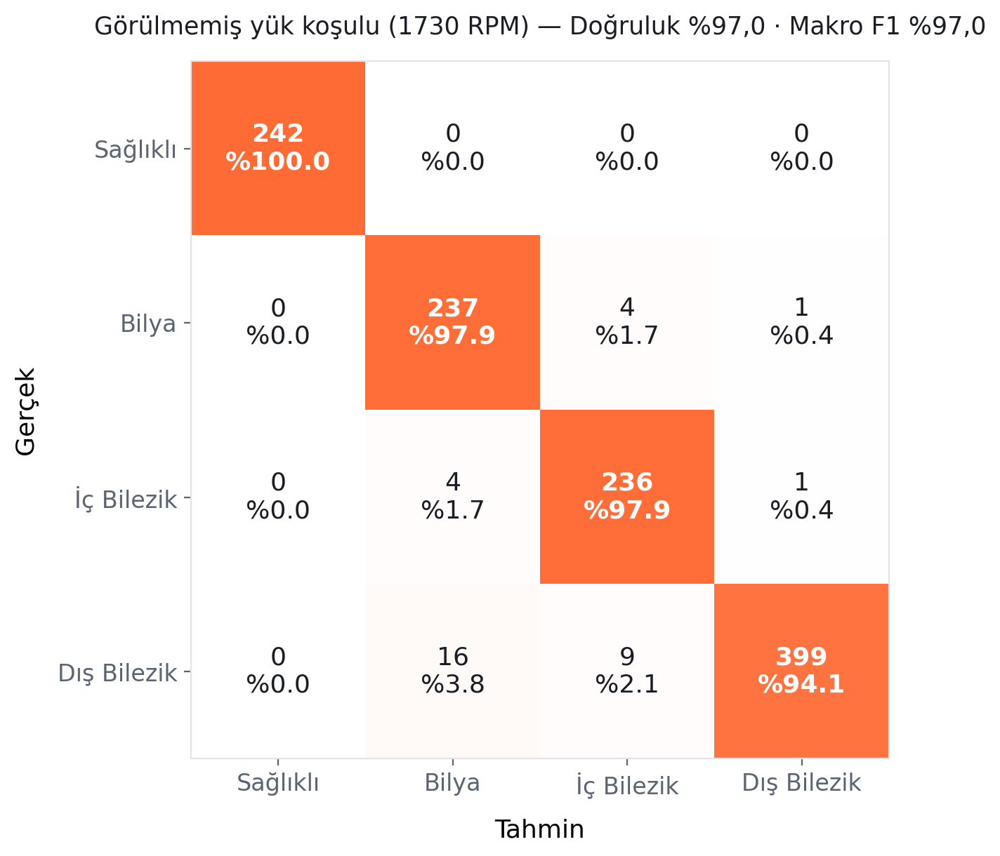

# Yapay Zeka ile Kestirimci Bakım Katmanı

Titreşim ve motor akımı (MCSA) verisiyle erken arıza tespiti — sahadan gelen bir
bakım mühendisinin uçtan uca kurduğu, bilinçli olarak **dar kapsamlı** bir
gözetimli öğrenme sistemi.

> **EN — Summary:** An end-to-end predictive maintenance layer built on the CWRU
> vibration dataset and a Mendeley motor-current (MCSA) dataset. Time-domain
> features (RMS, kurtosis, crest factor) feed a Random Forest classifier.
> Evaluated with a leakage-aware protocol: 97.4% accuracy under naive random
> window splitting vs **97.0% on a completely unseen load condition** (96.1%
> averaged across all four load hold-outs). Includes a drill-down dashboard
> (year → month → day → hour → minute) driven by a clearly labeled simulated
> scenario.

## Neden var?

Tekrarlayan arızaların çoğu, gerçekleşmeden önce sinyal verir. Sorun sinyalin
yokluğu değil, insan gözleminin geç kalmasıdır. Bu depo, o sinyali sistematik
olarak değerlendiren katmanın tamamını içerir: ham sinyalden özellik çıkarmaya,
model eğitiminden sızıntı testine, oradan tıklanabilir bir panele kadar.

## Sonuçlar (dürüst protokol)

CWRU çalışmalarının çoğu pencereleri rastgele böler; aynı kaydın komşu
pencereleri hem eğitime hem teste düşer ve sonuç şişer. Bu depo iki protokolü de
raporlar:

| Protokol | Doğruluk |
| --- | --- |
| Rastgele pencere bölmesi (sızıntı riskli, iyimser) | %97,4 |
| Yük-bazlı bölme — hiç görülmemiş 1730 RPM'de test | **%97,0** (makro F1 %97,0) |
| Çapraz kontrol — dört yükün her biri sırayla test | ortalama %96,1 |

Fark küçükse model ezber değil, örüntü öğrenmiştir. Karışıklık matrisi
(görülmemiş yük koşulu):



En zayıf nokta dış bilezik sınıfının ~%6'sının bilya / iç bilezik olarak
işaretlenmesi; sağlıklı sınıfta yanlış alarm sıfırdır.

## Veri setleri

1. **CWRU (titreşim):** Case Western Reserve Üniversitesi rulman veri setinin
   NumPy sürümü — [srigas/CWRU_Bearing_NumPy](https://github.com/srigas/CWRU_Bearing_NumPy)

   ```bash
   git clone https://github.com/srigas/CWRU_Bearing_NumPy
   ```

2. **MCSA (motor akımı):** "Current Signature Dataset of Three-Phase Induction
   Motor under Varying Load Conditions" —
   [Mendeley Data, gxdd74czwh](https://data.mendeley.com/datasets/gxdd74czwh/1).
   İndirilen CSV'ler `mcsa_data/Datasets/` altına açılır. İç/dış bilezik
   arızaları (0,7–1,7 mm), kırık rotor çubuğu (BRB) ve sağlıklı durum; 100/200/300 W yük.

## Betikler (çalıştırma sırasıyla)

| Betik | Ne yapar |
| --- | --- |
| `01_veriye_bakis.py` | CWRU .npz dosyasının kanallarını ve boyutlarını gösterir. |
| `02_ozellik_cikartma.py` | Tek sinyalde 5 özelliği (RMS, Std, Tepe, Kurtosis, Crest) hesaplar. |
| `03_veri_seti_olustur.py` | 1797 RPM kayıtlarını pencereleyip özellik CSV'si üretir. |
| `04_dagilim_kontrol.py` | Sınıf dağılımını doğrular. |
| `05_model_egit.py` | Random Forest eğitimi + rapor (rastgele bölme). |
| `05b_yuk_bazli_dogrulama.py` | **Sızıntı testi:** rastgele bölme ile yük-bazlı bölmeyi yan yana koşar; yukarıdaki tablo bu betiğin çıktısıdır. |
| `06_anomali_tespiti.py` | Isolation Forest ile yalnızca sağlıklı veriden anomali skoru (saha başlangıç modu). |
| `07_zaman_grafigi.py` | Simüle aylık kompozisyon grafiği. |
| `08_gercekci_senaryo.py` | Kademeli kötüleşme + yetersiz müdahale + nüksetme senaryosu (statik doğrulama çizimi). |
| `09_veri_uretimi.py` | Üç makinelik senaryonun yıllık→dakikalık CSV'lerini üretir. |
| `10_akim_veriseti.py` | MCSA CSV'lerinden akım özellik veri setini çıkarır. |
| `11_akim_hiyerarsi.py` | Akım tarafının yıllık/günlük senaryo dosyalarını üretir. |
| `12_dashboard.py` | Streamlit paneli (`streamlit run 12_dashboard.py`). |
| `15_pro_html_uret.py` | Sunucusuz, tek dosyalık HTML panel: yıl→ay→gün→saat→dakika kırılımı. |

```bash
pip install -r requirements.txt
```

## Şeffaflık notları

- Paneldeki üç makinelik zaman serisi **simüle edilmiş bir senaryodur**; gerçek
  saha telemetrisi değildir ve panelde bu açıkça etiketlenmiştir. Simülasyonun
  örneklediği pencereler ise gerçek laboratuvar kayıtlarından gelir.
- Sonuçlar laboratuvar verisine aittir; sahada gürültü daha fazladır ve doğruluk
  başlangıçta daha düşük çıkar, veri biriktikçe artar.
- Akım tarafında bu sürümde zaman-domain özellikleri kullanılmıştır; hat
  frekansı çevresinde yan bant (spektral) analizi yol haritasındadır.

## Lisans ve iletişim

MIT — bkz. `LICENSE`.

**Ozan Gözlüklü** · Elektrik-Elektronik Mühendisi ·
[LinkedIn](https://www.linkedin.com/in/ozan-gözlüklü/)
